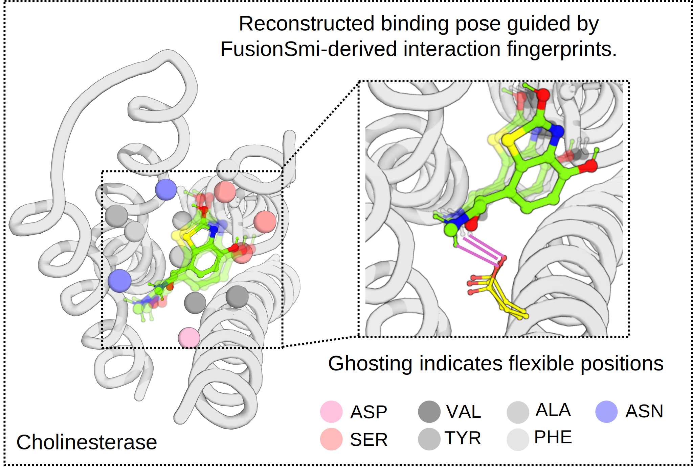
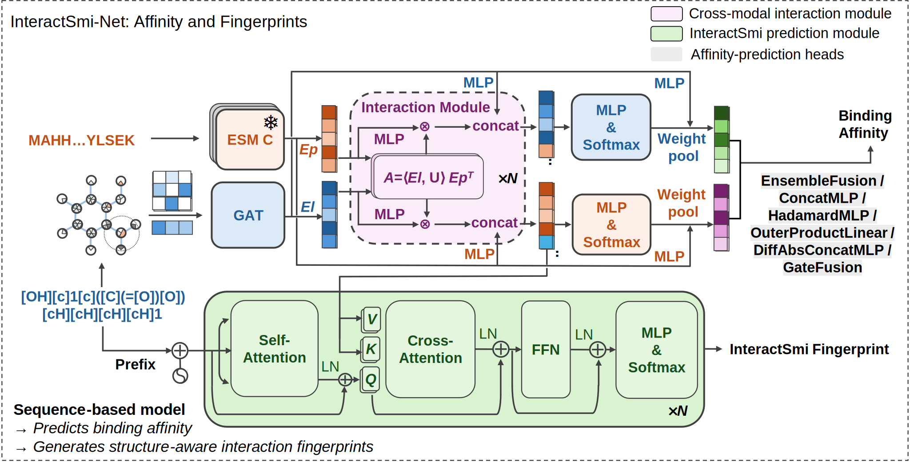

````markdown
# InteractSmi

**Learning the Language of Protein–Ligand Interactions**

Understanding how proteins and small molecules interact is a central challenge in drug discovery and structural biology. These interactions are not just single contacts—they form complex three-dimensional patterns that govern binding affinity and biological activity. Traditional approaches often rely on 3D structures to visualize interactions as graphs, but such representations can be limiting when reference structures are unavailable.  

To address this, we developed **InteractSmi**, a high-fidelity, efficient, and interpretable fingerprint that encodes protein–ligand interactions into a compact sequence-based representation—a “language” that captures the essential biochemical and geometric patterns of molecular interplay. Built on InteractSmi, our sequence-based model **InteractSmi-Net** achieves binding-affinity prediction accuracy comparable to leading structure-based methods, while offering significantly faster training and inference. InteractSmi can be applied even when protein or ligand reference structures are missing, providing plausible interaction patterns and active-pocket predictions. Using this approach, we also demonstrated reverse target fishing by identifying **FYN** as a previously unrecognized metformin-associated target, revealing potential new roles in neurological and cancer-related processes.
````

---

## Environment Setup

Create the environment from the provided `environment.yml`:

```bash
conda env create -f environment.yml
conda activate interactsmi_env
````

### Test the Environment

Run the test command:

```bash
python -m test.Test_model_evalue > evalue_log.txt 2>&1
```

This will execute the test script and save logs to `evalue_log.txt`.

---

## Dependencies

* Python 3.9
* CUDA 12.4 required for PyTorch GPU support
* Main dependencies include:

  * `pytorch-cuda`
  * `torchvision`, `torchaudio`
  * `ipykernel`
  * `pymol-open-source`
  * `openbabel`
  * `rdkit`

Check the log file if there are any errors during execution.

---

## Datasets

The datasets used in this study are publicly accessible from the following sources:

* **PDBbind v2020**: Available at the [PDBbind database](https://www.pdbbind-plus.org.cn/download).  
* **BindingNet**: Deposited in Zenodo, including Crystal Templates, High-confidence, Moderate-confidence, and Low-confidence subsets. Access via [BindingNet on Zenodo](https://zenodo.org/records/11218293).  
* **BindingDB**: Available from the [BindingDB repository](https://www.bindingdb.org/rwd/bind/index.jsp).

---

## InteractSmi Fingerprint

InteractSmi encodes protein-ligand interactions into a compact, interpretable sequence. It captures essential biochemical and geometric information, providing a “grammar” for molecular interplay. This fingerprint can be inferred from either the complex structure or separate protein and ligand sequences.

<p align="center">
  
</p>

---

## InteractSmi-Net Model Architecture

InteractSmi-Net is a sequence-based neural network built on the InteractSmi fingerprint. The model is designed for fast and accurate binding affinity prediction and interaction inference. Its architecture efficiently captures long-range dependencies and spatial interaction patterns while remaining interpretable.

<p align="center">
  
</p>

---

## Features

* High-fidelity protein-ligand fingerprinting
* Sequence-based model, no need for reference structures
* Fast training and inference (~10x speedup compared to complex-based methods)
* Interpretable binding pattern predictions
* Supports reverse target fishing applications